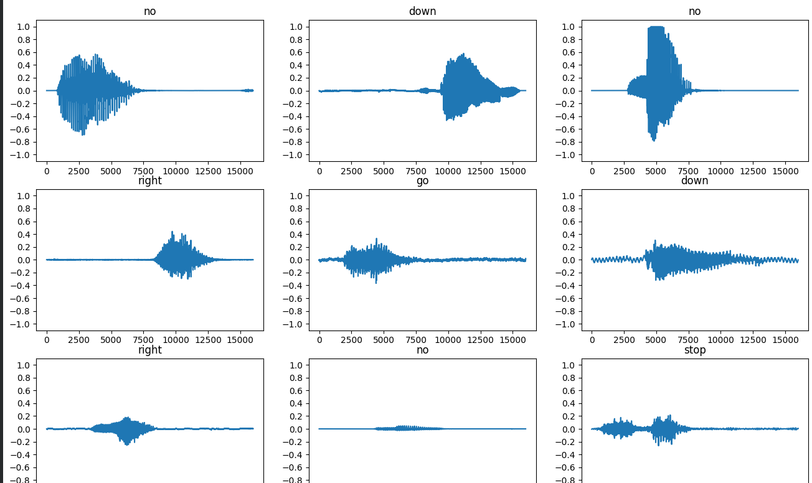
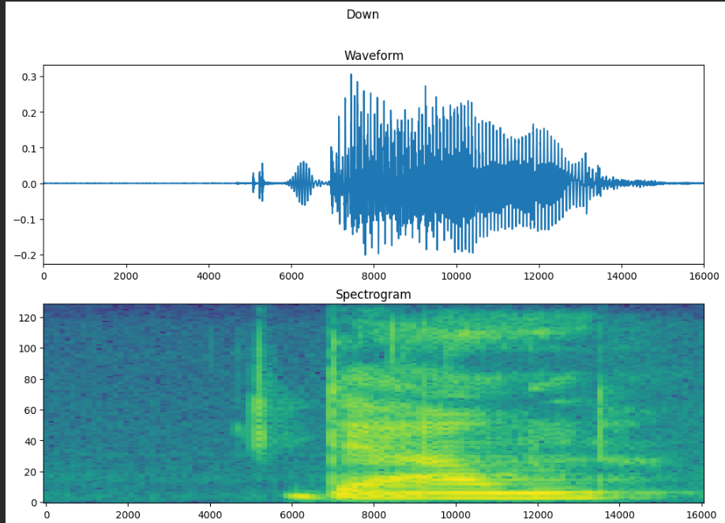
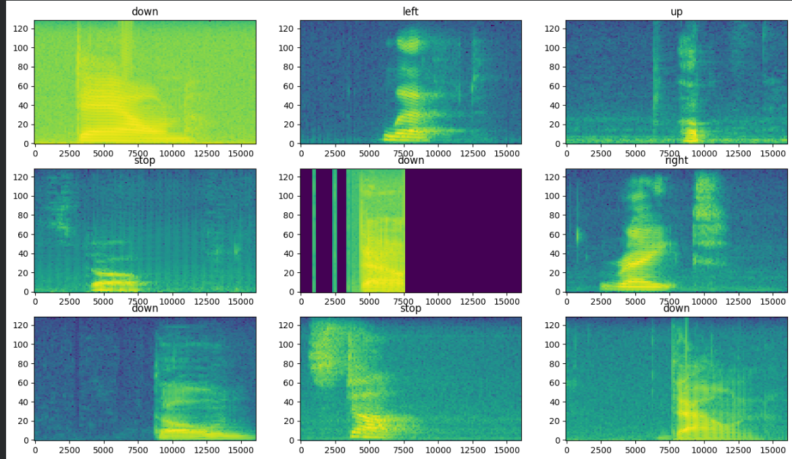
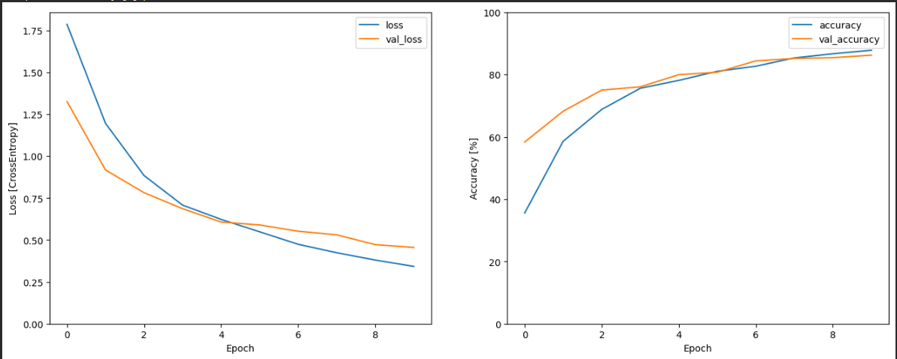
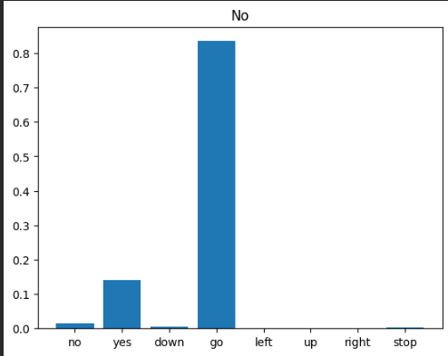

# Speech Command Recognition using CNN

A deep learning-based speech command recognition system built using TensorFlow and Convolutional Neural Networks (CNNs). The model classifies short spoken audio commands by converting audio waveforms into spectrograms and performing image-based classification.

---

## Overview

This project demonstrates how audio classification can be performed using spectrogram representations of speech signals and CNN-based deep learning architectures.

The model is trained on Google's Mini Speech Commands dataset and can recognize spoken commands such as:

- yes
- no
- up
- down
- left
- right
- stop
- go

---


## Sample Outputs

### Audio Waveform Samples


### Spectrogram Representation


### Spectrogram Samples


### Training Accuracy


### Prediction Output



---
## Features

- Audio preprocessing using Short-Time Fourier Transform (STFT)
- Spectrogram generation for feature extraction
- CNN-based speech classification
- TensorFlow/Keras implementation
- Training and validation visualization
- Real-time prediction testing on sample audio

---

## Tech Stack

- Python
- TensorFlow / Keras
- NumPy
- Matplotlib
- Librosa
- Seaborn

---

## Dataset

This project uses the Mini Speech Commands Dataset provided by TensorFlow.

Dataset source:
https://storage.googleapis.com/download.tensorflow.org/data/mini_speech_commands.zip

---

## Project Pipeline

1. Load audio dataset
2. Convert waveform to spectrogram
3. Normalize and preprocess data
4. Train CNN model
5. Evaluate model performance
6. Predict spoken commands from audio samples

---

## Model Architecture

The CNN architecture includes:

- Conv2D layers
- MaxPooling
- Dropout regularization
- Dense fully connected layers

The spectrograms are treated as image inputs for classification.

---

## Results

The model achieved approximately 95% validation accuracy


---

## Installation

Clone the repository:

```bash
git clone https://github.com/GantiYasaswini/speech-command-recognition-cnn.git
cd speech-command-recognition-cnn
```
Install dependencies:

```bash
pip install -r requirements.txt
```

Run the notebook:

```bash
jupyter notebook
```

---

## Future Improvements

- Real-time microphone inference
- Deployment using TensorFlow Lite
- Larger speech datasets
- Advanced architectures such as CRNNs or Transformers
- Noise robustness enhancement

---

## Repository Structure

```text
speech-command-recognition-cnn/
│
├── README.md
├── requirements.txt
├── speech_command_recognition.ipynb
│
├── assets/
│   ├── waveform.png
│   ├── spectrogram.png
│   ├── training_accuracy.png
│   └── prediction_output.png
│
└── sample_audio/
    └── audio_sample.wav
```

---

## Key Concepts Used

- Convolutional Neural Networks (CNNs)
- Audio Signal Processing
- Spectrogram Feature Extraction
- Deep Learning for Audio Classification
- TensorFlow Data Pipelines

---

## Acknowledgements

- TensorFlow
- Google Speech Commands Dataset
- Librosa Audio Processing Library

---
## Author

Developed by Yasaswini Ganti using TensorFlow and CNN architectures for speech command recognition and audio classification.
